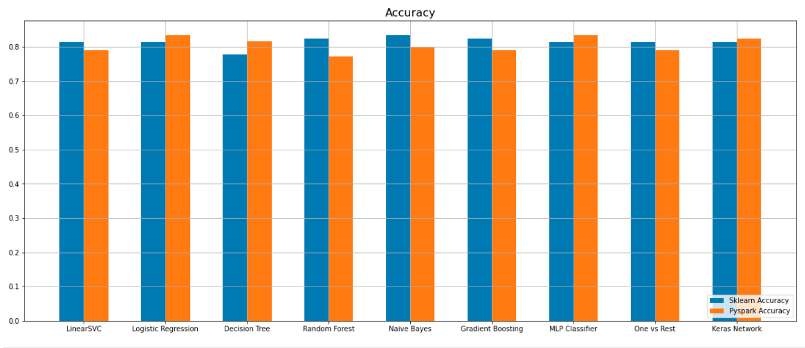
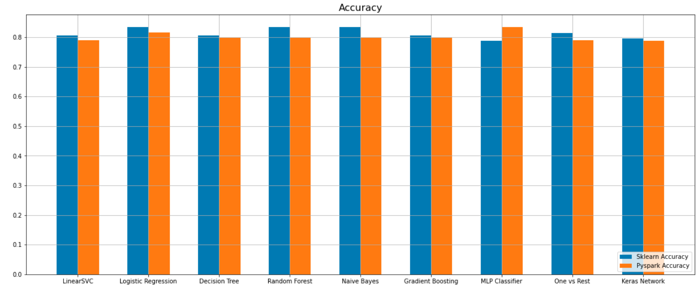
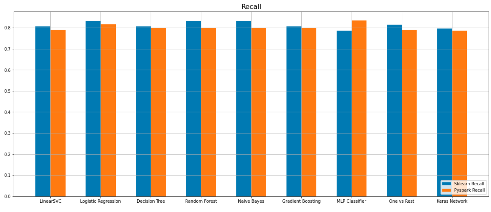
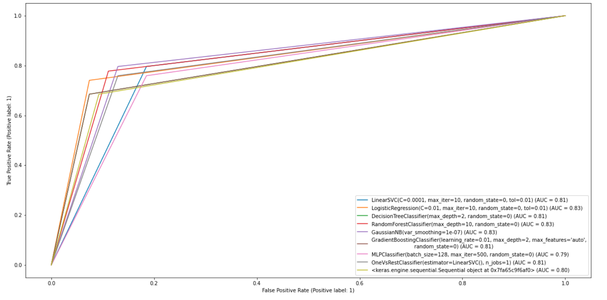
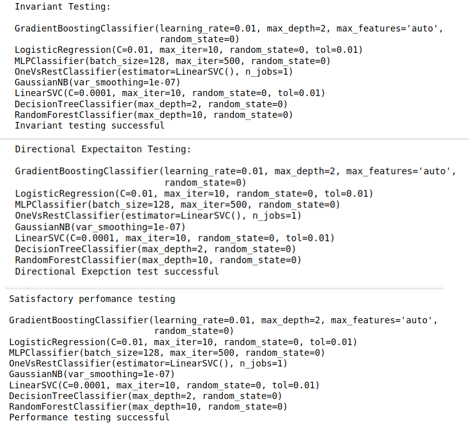

# [BDMA – Big Data Management and Analytics](https://bdma.ulb.ac.be/)
## [Technische Universität Berlin](https://www.tu.berlin/en/)
## Master Thesis 
## On The Problem of Software Quality In Machine Learning Systems

 Supervisor: [Prof. Dr. Volker Markl](https://www.tu.berlin/en/dima/about-us/prof-dr-volker-markl)  

 Advisor:[Juan Soto](https://www.user.tu-berlin.de/juan.soto/), (Academic Director)  
 
## Abstract
Machine learning quality evaluation for classification algorithms with model behavioral testing, which is the state of the solution for model testing to improve data and model quality.
## Objective
Evaluating the quality of ML classification algorithms for 17 classifiers from Spark ML, Keras, and Scikit-learn to detect or minimize ML bugs at an early stage before a model is deployed. This is accomplished through code testing of the data processing, training, and evaluation method. Model testing to check if what the model has learned is correctly applied. Testing of data by writing pre-train tests before the data feed to the ML models. In addition, to improve the quality of the classifier, evaluate them with selected model quality attributes (properties) on three popular classification datasets from [Kaggle](https://www.kaggle.com/) 

## Tools and Software
We used the following tools to develop the machine-learning prototype 
1. ML libraries: Scikit-Learn, Spark ML, and Keras 
2. IDE and Programming languages: Jupyter Notebook and Python 
3. [MLflow: An open-source platform for the machine learning lifecycle](https://mlflow.org/)(On Progress)
   *  Track experiment hyperparameters, performance scores, visualizations, processed data, model pickle files, etc   
4. [Deepchecks: Testing Machine Learning Models: ](https://deepchecks.com/)
    * We used deepchecks to evalaute data quality issues and model performance tests

## Machine Learning Model Testing Technique
We took significant inspiration from model behavioral testing for NLP models, **Deepchecks**, a tool for assessing data and model quality, and **Drifter-ML**, a novel framework for performance testing of classification models

1.  **Model Pre-train tests** 
    * To ensure data quality through writing assertion on the different feature of three datasets for example, 
        * For the titanic dataset, the value of the class label must be two **1: Surived** and **0: not surived** 
        * The values of the PClass column must be 1, 2 or 3, otherwise it is unkown value   
    *  We also used **Deepchecks** to detect duplicates, type mismatches, train test distributions, etc 
2.  **Model Post-train tests**
     * We employed post-train tests to evaluate the behavior of the trained models
     * **Invariant tests:** testing to changes in the less relevant features and see how prediction varies  
     * **Directional expectation tests:** testing for changes in relevant features and checking how the model prediction reacts 
3. **Model Performance Evaluation**
   * We used a machine learing model validation tool ***Drifter-ML*** to evaluate performance thresholds of the classification models
5. **Data and Model validation using DeepChecks**
   * We used Deepchecks for testing the train and test data for numerous features and various model capabilities. For this task we used Deepecheck's full_suite() testing approach   
# Datasets Used for the Experimentation
We used three popular classification datasets from Kaggle to evaluate the classification algorithms
1. **Fashion MNIST Dataset** 
  *  The dataset consists of 60,000 training examples and 10,000 test examples of Zalando's article images. 
2. **Titanic Disaster Dataset**
  *  The dataset describes the survival status of individual passengers as a result of the sinking of the Titanic in early 1912.
3. **Pima Indian Diabetes Dataset**
  * The dataset is originally from the National Institute of Diabetes and Digestive and Kidney Diseases. It is used to determine whether or not a patient has diabetes, based on certain diagnostic measurements.

# Machine Learning Algorithms
  * We have chosen 8 classifiers from the Scikit-Learn , 8 from Spark ML and Keras Network
  * We select algorithms that are equally present in the libraries. That is they have the same mathematical formulation and the same or similar set of hyperparameters.
  * Furthermore, the classifiers are popular among different ML users
1.  LinearSVC
2.  LogisticRegression
3.  DecisionTreeClassifier
4.  RandomForestClassifier
5.  GaussianNB |  NaiveBayes(modeltype='Gussian')
6.  GradientBoostingClassifier |GBTClassifier
7.  OneVsRest | OneVsRestClassifier
8.  MLPClassifier
9.  Keras Classifier

## Model Evaluation Properties
We have used the following quantitative and qualitative machine learning properties to evaluate and analyze the various classifiers
* **Performance**
* **Robustness**
    * How the model reacts to slight changes in the Input data. 
        * It can be achieved by how the model reacts to relevant and irrelevant features
    * Ivariant and directional expectation tests
* **Reproducibility**
    * Model reproducibility is achieved by adjusting model training parameters 
    * During the train test split process to have representative and reproducible splits for various runs
    * Another way to make ML systems reproducible is to use similar development environments, operating systems, ML frameworks, or containers.

 * We used MLflow to track experiment artifacts such as performance scores, visualizations, best hyperparameters, model pickle files, and other relevant artifacts to make the entire workflow reproducible.  
* **Explainability and Interpretability** 
     * Visualizing individual model prediction using a tool called **LIME**:Local Interpretable Model-agnostic Explanations
     * LIME makes black box decision-making of a classifier more interpretable 

## Comparative Analysis
The follosing screenshots are from the experimental analysis of our project
#### Accuracy of Baseline Models

#### Accuracy of Optimized Models

#### Recall of Optimized Models

#### Roc Curves of Opimized Models from sklearn

#### Result of Invariant Directional Expection tests and Performace degrade tests

