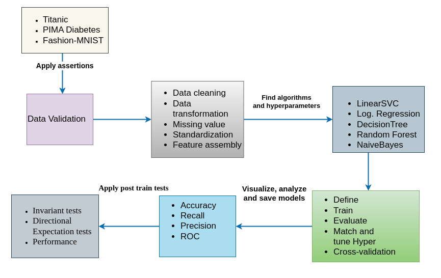
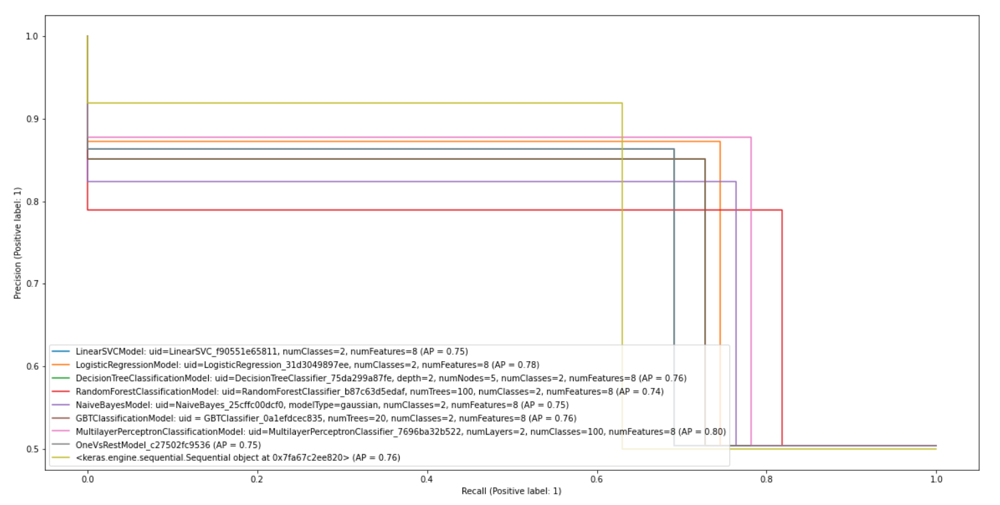
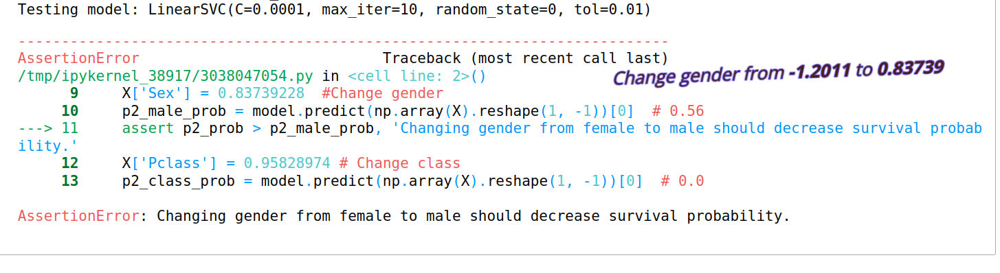
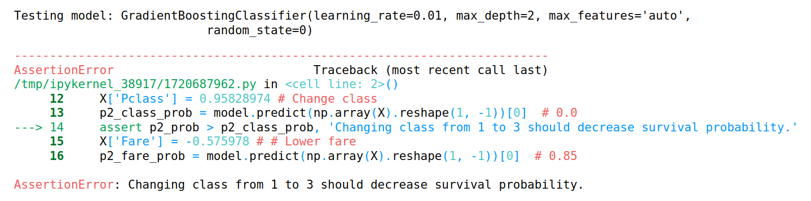
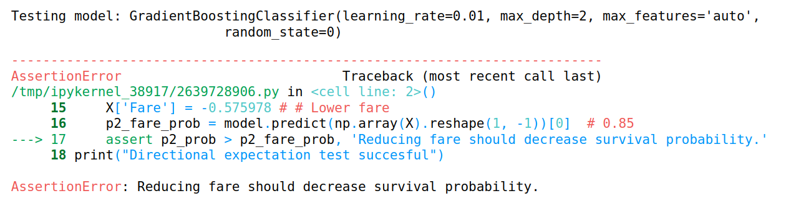

# [BDMA – Big Data Management and Analytics](https://bdma.ulb.ac.be/)
## [Technische Universität Berlin](https://www.tu.berlin/en/)
## Master Thesis 
## On The Problem of Software Quality In Machine Learning Systems

 1. **Supervisor**: [Prof. Dr. Volker Markl](https://www.bifold.berlin/people/Prof.%20Dr._Volker_Markl.html)  
 Volker Markl is a German computer scientist, database systems researcher, and a full professor  
 2. **Advisor**: [Juan Soto](https://www.user.tu-berlin.de/juan.soto/)  
 Juan Soto is an Academic Director in the Chair of Database Systems and Information Management at the Technische Universität Berlin

## Project Structure

   * **Data**:contain the datasets for experimentation 
   * **Eval**: Implement metrics and visualizations for evaluation
   * **Models**: contains implementation logic of classification models
   * **Preprocess**: stores code artifacts for explanatory data analysis
   * **Tests**: contain model post train test implementation
   * **Utils**: contain data processing logic and some helper functions for the various models and libraries
   * **Docreport**: contain presentation slide for defense and thesis documentation

## Abstract
In an effort to discover previously undisclosed bugs, minimize possible bugs, and find discrepancies, we designed and implemented an end-to-end machine-learning application to examine seventeen (17) classification algorithms from Scikit-learn, PySpark, and Keras Network. We employed systematic and uniform data preprocessing and model pre-train testing to assert the quality of data using Pandas and Spark DataFrames. Furthermore, we implemented model post-train test cases using invariant testing and directional expectation tests to examine how the model reacts to changes in relevant and irrelevant features while keeping the other features constant. From the empirical experiments, no observable differences were found to provide evidence of a previously undiscovered bug. The variation in performance of the models from varying frameworks is negligible.

# Objective
The thesis objecitve is to answer the following question to build user trust in using open-source ML systems. 

* How users of machine learning systems, including practitioners, researchers, and members of society, can gain confidence in using and deploying machine learning software And how should open-source ML software systems be tested?
* How much confidence do users realistically have in publicly-available machine learning systems to build and deploy ML applications using classification algorithms?
* What is considered adequate when testing machine learning systems? 
* Who determines what testing is appropriate for a given machine learning software and what the risks arenovel ways for testing machine learning, and the unique challenges associated with them?
* What makes machine learning systems vastly different from conventional software systems? What are the state-of-the-art solutions for testing machine learning classification models, and how do you apply them in practice?
* What are the novel ways for testing open-source machine learning systems? 

## Problem statement 
For the implementation we focused on model behavioral testing in order to test ML models. We use concepts from model behavioral testing for NLP models called [Beyond Accuracy: Behavioral Testing of NLP models with CheckList](https://homes.cs.washington.edu/~marcotcr/acl20_checklist.pdf), developed to evaluate a sentiment analysis model beyound the performance scores. From the developed prototype, we answered the following questions  

* What are representative examples of frequently occurring bugs in machine learning?
* What are the ideal data preparation and feature engineering practices for consistent performance across various metrics?
* What are the latest open-source data and model validation tools?
* Why are data and model validation so significant in operational ML systems?
* How can we minimize training an erroneous implementation of a model using pre-training tests?
* How to evaluate and optimize machine learning models to maximize performance?
* How can we evaluate or ensure the expected behavior of trained classification models?
## Tools and Softwoares 
We used the following tools to develop the machine-learning prototype 
1. **Scikit-Learn** is an open-source Python library that implements a range of machine learning algorithms using a unified API. 
2. **PySpark** is a Python API for machine learning applications built on top of Spark ML
3. **Keras** is an open-source library that provides a Python interface for ANN. 
4. **Python** is a high-level, general-purpose, interpreted, interactive and object- oriented programming language designed to be highly readable.
5. **Jupyter Notebook** is a browser-based tool for interactive development that
combines explanatory text, mathematics, computations, and their rich media output
6. [MLflow: An open-source platform for the machine learning lifecycle](https://mlflow.org/)(on progress)
   *  Track experiment hyperparameters, performance scores, visualizations, processed data, model pickle files, etc   
7. [Deepchecks: Testing Machine Learning Models: ](https://deepchecks.com/)
    * **deepchecks** was employed to evalaute data quality and model performance caused by **data** and **concept** drifts 

# Datasets
We used three popular classification datasets from Kaggle to evaluate the classification algorithms
1. **Fashion MNIST Dataset** 
  *  The dataset consists of 60,000 training examples and 10,000 test examples of Zalando's article images. 
2. **Titanic Disaster Dataset**
  *  The dataset describes the survival status of individual passengers as a result of the sinking of the Titanic in early 1912.
3. **Pima Indian Diabetes Dataset**
  * The dataset is originally from the National Institute of Diabetes and Digestive and Kidney Diseases. It is used to determine whether or not a patient has diabetes, based on certain diagnostic measurements.
  
## Experimental Workflow 
 To anser the above question, we designed the following end-to-end workflow. 

## Model Testing 
We took significant inspiration from model behavioral testing for NLP models, **Deepchecks**, a tool for assessing data and model quality, and **Drifter-ML**, a novel framework for performance testing of classification models

1.  **Model Pre-train tests** 
    * To ensure data quality through writing assertion on the different feature of three datasets for example, 
        * For the titanic dataset, the value of the class label must be two **1: Surived** and **0: not surived** 
        * The values of the PClass column must be 1, 2 or 3, otherwise it is unkown value   
    *  We also used **Deepchecks** to detect duplicates, type mismatches, train test distributions, etc 
2.  **Model Post-train tests**
     * We employed post-train tests to evaluate the behavior of the trained models
     * **Invariant tests:** testing to changes in the less relevant features and see how prediction varies  
     * **Directional expectation tests:** testing for changes in relevant features and checking how the model prediction reacts 
3. **Model Performance Evaluation**
   * We used a machine learing model validation tool ***Drifter-ML*** to evaluate performance thresholds of the classification models
5. **Data and Model validation using DeepChecks**
   * We used Deepchecks for testing the train and test data for numerous features and various model capabilities. 
   * We used Deepecheck's **full_suite()** method by first tranforming the train and test sets into DeepChecks comptabile **Datasets**     

# Classification Algorithms
  * We have chosen 8 classifiers from the Scikit-Learn, 8 from PySpark and 1 from Keras
  * We have choosen classification algorithms that are equally present and have the same mathematical formulation with the same or similar set of             hyperparameters.
1.  LinearSVC
2.  LogisticRegression
3.  DecisionTreeClassifier
4.  RandomForestClassifier
5.  GaussianNB |  NaiveBayes(modeltype='Gussian')
6.  GradientBoostingClassifier |GBTClassifier
7.  OneVsRest | OneVsRestClassifier
8.  MLPClassifier
9.  Keras Network Classifier

##  Result Analysis
* The following shows the performance of the 17 classifiers using accuracy, recall,precision, and ROC for baseline and optimized models using the Titanic   dataset
#### Accuracy of baseline models

#### Accuracy of optimized Models

#### Recall of optimized models

#### Roc curves of opimized models from sklearn

## PySpark PrecisionRecall curve for optimized models

## Model Post-Train tests 
* The following screenshot shows the successful tests for invariant and directional epection tests , and performace degrade tests
* The three tests are helpful to ensure the robustness of the models before they get deployed. 

* The following shows some of the failed tests for **GradientBoostingClassifier**, and **LinearSVC** by changing three relevant features 
* PClass, Gender and Fare are the relevant feature of the Titanic dataset

## Conclusion
We created and constructed a machine-learning application to analyze and assess seventeen (17) classification methods from Scikit-Learn, PySpark, and Keras Network in an effort to detect previously unreported defects, reduce potential bugs, and find discrepancies. In summary, 

* We created a standardized approach for data preparation, model evaluation, and model robustness testing using Pandas and Spark DataFrames for 17          classifiers 
* We implemented model post-train tests to ensure learned behavior works as expected. We demonstrated this using invariant testing and directional         expectation tests using the scikit-learn saved models for a representative data instance
* We performed trained model and data drift tests using DeepCheecks
* From the empirical experiments, no observable differences were found to provide evidence of a previously undiscovered bug, and also the variation in performance of the models from varying frameworks is negligible.
## Future Work

 In the future, we will
 * Implement automatic model bug detection , track model artificats, best hyperparameters, visualizations, and data
 * Implement complete robustness testing for all models
 * Design and implement metamorphic testing using metamorphic relations. The metamorphic relations can be designed by performing data transformations on     the base data.
 * Publish the system online to serve as a benchmark 
